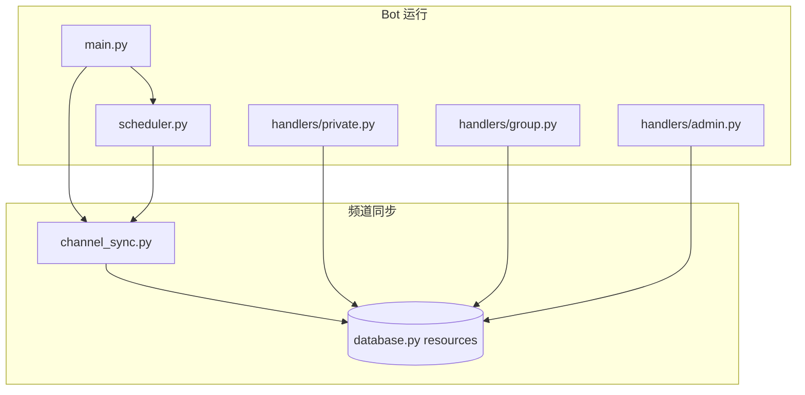

# 麻辣鹅社区 Bot · 群组管理 + 淮安榜资源同步

Telegram **社区群管 Bot**：在群组里做欢迎、关键词回复、定时广告、举报；在私聊里展示 **淮安榜老师资源按钮**；后台从 **一个公开频道** 定时同步在榜老师到本地 `resources` 表。

**仓库地址：** https://github.com/joeykini/tgbotforgroup

---

## 与「源站抓取 Bot」的区别

本项目和 [`tggroupchannel`](https://github.com/joeykini/tggroupchannel)（桌面目录常见名 `telegrambot`）是 **两个独立 Bot、两个仓库**，职责不同：

| | **本仓库 `tgbotforgroup`** | **源站抓取 `tggroupchannel`** |
|---|---|---|
| 定位 | 麻辣鹅 **社区群 + 私聊资源导航** | **源频道抓取 → 人员库 → 统一榜发布** |
| 技术 | aiogram 2.x + Bot Token | Telethon 用户号 + 管理 Bot |
| 数据来源 | HTTP 抓 `@huaianbendi` 公开预览页 | Telethon 监听 2 个源频道 + 2 个出勤群 |
| 核心数据 | `resources` 资源表（按钮链接） | `persons` 人员库（预览/发布状态） |
| 发布 | **无**（只展示链接，不往频道发帖） | 手动/批量发布到目标频道 |
| 去重/未发 | 无「已发/未发」概念 | 有 `library_status`、目标频道名字去重 |
| 管理入口 | 群内/私聊 `/settings` | `/library`、`/roster` 等 |

简单记：**本 Bot = 给用户点链接、管群；另一个 Bot = 运营抓帖和发榜。**

---

## 功能概览

### 私聊用户

- `/start`：欢迎语 + **3 列资源按钮**（❤️ 可约 / 😈 月休）
- 分页：首屏 / 区域筛选 / 广告页
- 需先关注配置的频道（默认淮安榜 + 麻辣鹅圈子）
- 签到、我的统计、踩雷报告（可配置报告频道）

### 群组

- 新人欢迎（可关）
- 关键词 **「麻辣鹅」** 及地区名、价格档 → 自动回复在榜列表
- 定时随机广告（可配置多条、间隔）
- 防外链（可关）
- 可选：入群自动踢非授权 Bot（默认关）
- 群管命令：`/mute` `/unmute` `/kick` `/kickbot` `/del`

### 管理员 `/settings`

| 菜单 | 作用 |
|------|------|
| 📡 频道同步 | 从淮安榜抓老师 → 写入 `resources` + 自动生成关键词 |
| 🔘 资源列表 | 查看/切换状态/删除；手动添加资源 |
| 💬 关键词 | 手动关键词；自动项由同步生成不可删 |
| 📢 关注管理 | 强制关注频道列表 |
| 🔗 链接配置 | 新人说明、群规、VPN 等 URL |
| 🕒 定时广告 | 添加/编辑/删除定时群发广告 |
| 📝 报告频道 | 踩雷报告推送目标 |
| ⚙️ 功能开关 | 欢迎、防外链、踢 Bot |

**权限：** `BOT_ADMIN_ID` 超级管理员，或 `BOT_ADMIN_CHATS` 中频道/群的管理员。

**系统命令（需管理员）：**

| 命令 | 说明 |
|------|------|
| `/sync` | 立即从淮安榜同步资源 |
| `/broadcast 内容` | 私聊群发所有记录过的用户 |
| `/export` | 导出 `bot_data.db` |
| `/import` | 上传数据库覆盖（caption 带 `/import`） |

---

## 快速部署

### 1. 克隆

```bash
git clone https://github.com/joeykini/tgbotforgroup.git ~/tgbot_group
cd ~/tgbot_group
```

### 2. 环境与依赖

```bash
python3 -m venv venv          # start.sh 会优先用 venv/
source venv/bin/activate
pip install -r requirements.txt

cp .env.example .env
nano .env                     # 必填 BOT_API_TOKEN、BOT_ADMIN_ID
```

### 3. 启动 / 停止

```bash
chmod +x start.sh stop.sh

./start.sh                      # 后台运行，日志 bot.log
tail -f bot.log

./stop.sh                       # 停止
```

或手动：

```bash
source venv/bin/activate
python main.py
```

### 4. 更新代码并重启

```bash
cd ~/tgbot_group
./stop.sh
git pull
source venv/bin/activate
pip install -r requirements.txt   # 仅 requirements 变更时需要
./start.sh
```

---

## 配置说明（`.env`）

| 变量 | 必填 | 说明 |
|------|------|------|
| `BOT_API_TOKEN` | 是 | [@BotFather](https://t.me/BotFather) 创建的 Bot Token |
| `BOT_ADMIN_ID` | 是 | 超级管理员 Telegram 用户 ID |
| `BOT_ADMIN_CHATS` | 否 | 可操作后台的频道/群，逗号分隔，默认 `@huaianbendi,@hamalae8` |
| `BOT_DB_NAME` | 否 | SQLite 文件名，默认 `bot_data.db` |
| `BOT_SYNC_CHANNEL` | 否 | 抓取源频道用户名，默认 `huaianbendi` |
| `BOT_SYNC_INTERVAL` | 否 | 自动同步间隔（秒），默认 `14400`（4 小时） |

运行时还可通过 `/settings` 写入 `settings` 表（如 `SYNC_INTERVAL`、`REQUIRED_CHANNELS`、`AD_INTERVAL` 等），**数据库配置优先于代码默认值**。

---

## 频道同步逻辑（核心）

数据源：**仅一个频道**的 Telegram 公开预览页 `https://t.me/s/{channel}`，**不是** Telethon 用户号抓群/抓多源。

```
启动 main.py / 定时任务 / /sync / 后台「立即同步」
        ↓
channel_sync.fetch_channel_teachers()
  · 最多翻 15 页（?before=）
  · 解析含「名字:」的帖子块
        ↓
channel_sync.parse_teacher_block()
  · 提取：名字、一次价格、地区、电报、频道
  · 优先「电报」→ t.me 链接；否则用「频道」链接
  · ⚠ 无有效链接 → 整条丢弃（不入库）
        ↓
database.replace_channel_resources()
  · DELETE 所有 source='channel' 的行
  · 重新 INSERT 同步结果（手动 source='manual' 保留）
        ↓
database.replace_auto_keywords()
  · 自动生成：麻辣鹅、7 地区、4 价格档 的关键词回复
```

### 去重规则（同步内）

- 翻页从 **新到旧**，**同名老师只保留最新一条**（`teachers_by_name` 字典按名字去重）
- **没有**与「目标频道已发布名单」的二次去重（那是 `tggroupchannel` 的逻辑）

### 与「电报不全」相关

当前实现：`parse_teacher_block()` 在 **没有电报也没有频道链接** 时返回 `None`，**不会进入 resources**。

若希望「电报不全也先进库、等人工补链接」，需要改 `channel_sync.py` 的解析与 `database.replace_channel_resources()` 的写入策略（可参考 `tggroupchannel` 的 `draft` 思路，但本 Bot 无发布流程，通常改为 `url` 留空 + 后台补全）。

---

## 代码结构

```
tgbot_group/
├── main.py              # 入口：启动同步 + aiogram polling
├── loader.py            # Bot、Dispatcher、Database 单例
├── config.py            # .env 与 DefaultConfig
├── database.py          # SQLite：users / resources / keyword_replies / ...
├── channel_sync.py      # HTTP 抓频道 + 解析 + sync_channel_to_db()
├── scheduler.py         # 定时广告 + 定时频道同步
├── filters.py           # 管理员权限（超管 + 指定频道/群管）
├── utils.py             # 关注校验、消息定时删除
├── states.py            # 后台 FSM 状态
├── handlers/
│   ├── private.py       # /start、资源网格、统计、报告
│   ├── group.py         # 欢迎、关键词、群管命令
│   └── admin.py         # /settings 全套后台
├── start.sh / stop.sh   # 启停脚本
└── bot_data.db          # 运行时数据库（勿提交 git）
```

### 模块关系



---

## 数据表要点

| 表 | 用途 |
|----|------|
| `resources` | 老师资源：`name`, `url`, `status`(1❤️/0😈), `price`, `region`, `page`, `source`(channel/manual) |
| `keyword_replies` | 关键词回复；`is_auto=1` 为同步生成 |
| `settings` | 键值配置（JSON 可嵌套） |
| `users` | 用户积分、消息统计 |
| `scheduled_ads` | 定时广告内容与图片 file_id |
| `reports` | 踩雷报告与投票 |
| `active_groups` | Bot 所在群列表（用于群发广告） |

**`resources.status`** 表示可约/月休，**不是**「是否已发到某个频道」。

---

## 用户侧资源展示

`handlers/private.py` → `get_resource_grid_keyboard()`：

- 从 `resources` 按 `page` 读取
- ❤️ `status=1` 在前，😈 `status=0` 在后
- 每行最多 3 个 **URL 按钮**（点击跳转 `url` 字段）
- 区域页通过 `filter_region_*` 按 `region` 筛选

群组内发「清江浦」「5z-8z」等 → `database.get_keyword_reply()` 匹配最长关键词 → 回复 Markdown 列表（内容在 `channel_sync.build_*_keyword_content` 生成）。

---

## 常见改动入口

| 想改什么 | 文件 |
|----------|------|
| 抓哪些帖、翻页数 | `channel_sync.fetch_channel_teachers` |
| 帖子字段解析（电报/频道/价格） | `channel_sync.parse_teacher_block` |
| 同步后写库方式 | `database.replace_channel_resources` |
| 自动关键词文案 | `channel_sync.build_mala_keyword_content` 等 |
| 私聊按钮布局 | `handlers/private.py` |
| 群关键词触发 | `handlers/group.py` → `group_keyword_handler` |
| 后台菜单与资源 CRUD | `handlers/admin.py` |
| 强制关注频道 | `config.REQUIRED_CHANNELS` 或 settings 里改 |
| 同步/广告间隔 | settings `SYNC_INTERVAL` / `AD_INTERVAL` |

---

## 权限与 Bot 设置

1. 在 [@BotFather](https://t.me/BotFather) 创建 Bot，拿到 Token 填入 `.env`
2. 将 Bot **加入** 麻辣鹅群组，并授予：删消息、禁言、踢人等（按需）
3. Bot 需能读取 `BOT_ADMIN_CHATS` 里频道/群的成员信息（用于判断管理员）
4. 获取自己的 ID：[@userinfobot](https://t.me/userinfobot)

---

## 安全与备份

- **不要** 把 `.env`、`bot_data.db` 提交到 Git（已在 `.gitignore`）
- 定期 `/export` 备份数据库
- Token 泄露后立即在 BotFather 重置

---

## 故障排查

| 现象 | 可能原因 |
|------|----------|
| `/settings` 无权限 | 用户 ID 不在 `BOT_ADMIN_ID`，且不是 `ADMIN_CHATS` 里频道/群管 |
| 同步 0 人 | 源频道预览页结构变化、网络无法访问 t.me/s、或帖子里无「名字:」 |
| 私聊无按钮 | 用户未关注 `REQUIRED_CHANNELS`；或 `resources` 为空，先 `/sync` |
| 关键词不回复 | 关键词被更长词覆盖；或自动关键词尚未同步 |
| 启动失败 | `.env` 缺 Token；或 `main.py` 已在跑（`start.sh` 会检测） |

---

## 相关链接

- **本仓库：** https://github.com/joeykini/tgbotforgroup
- **源站抓取 / 人员库 / 发榜：** https://github.com/joeykini/tggroupchannel
- **淮安榜频道：** https://t.me/huaianbendi
- **麻辣鹅圈子群：** https://t.me/hamalae8
